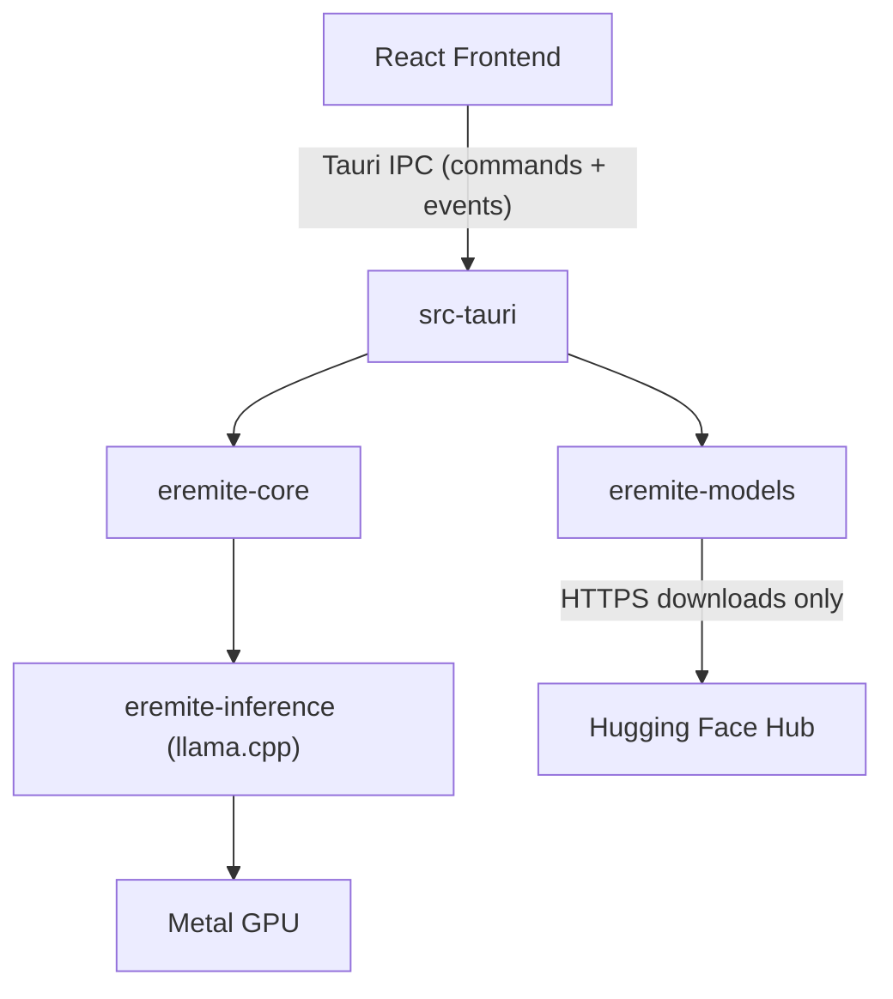

# Eremite Architecture

Eremite is a local LLM application that lets users download open source models and run them entirely on their own hardware. This document describes the system architecture.

## Overview



## Components

### eremite-core

Core engine library. Manages conversation state, configuration, and inference orchestration. All application logic lives here -- not in the frontend or the Tauri layer.

`eremite-core` depends only on `eremite-inference` -- it does **not** depend on `eremite-models`. This keeps networking crates (`reqwest`, `tokio`, etc.) completely out of core's dependency tree. Core accepts model file paths directly (`&Path`); the Tauri layer resolves those paths via `eremite-models` before passing them to core.

The crate defines an `InferenceProvider` trait that abstracts the inference boundary, allowing core to be tested with a mock implementation that requires no GPU or GGUF model. The production implementation (`LlamaInference`) wraps `eremite-inference::InferenceEngine`.

### eremite-inference

Wraps [llama.cpp](https://github.com/ggerganov/llama.cpp) via the [`llama-cpp-2`](https://github.com/utilityai/llama-cpp-rs) Rust bindings. Handles model loading, tokenization, sampling, and inference. Targets the GGUF model format with Metal GPU acceleration on macOS.

The public API centers on `InferenceEngine`, which loads a GGUF model and exposes two generation methods:

- `generate(prompt, params, callback)` -- raw text completion from a prompt string.
- `generate_chat(messages, params, callback)` -- applies the model's embedded chat template to a list of `ChatMessage` structs, then generates. Using the model's own template avoids the fragile and error-prone task of reimplementing per-model formatting outside the inference layer.

Both methods stream tokens to the caller via a synchronous `FnMut(InferenceEvent)` callback. This keeps the crate free of async runtime dependencies (`tokio`, etc.) and matches the callback pattern used in `eremite-models` for download progress. Callers that need async (e.g., `eremite-core` bridging to Tauri events) wrap the callback with a channel sender.

This crate has **no network or async runtime dependencies**. It is fully offline by design.

### eremite-models

Downloads GGUF models from Hugging Face Hub, manages local model storage (`~/.eremite/models/`), and tracks model metadata. Also exposes read-only discovery against the public Hub `/api/models` HTTP API (search and popular lists).

This is the **only crate with network access** in the entire project.

### src-tauri

The Tauri v2 application shell. Wires `eremite-core`'s Rust API to Tauri commands and events for the frontend to consume. This is the integration layer that connects `eremite-models` (model discovery and download) with `eremite-core` (inference orchestration) -- for example, resolving a model's on-disk path via `ModelManager::model_path()` and passing it to `CoreEngine::load_model()`.

The Tauri layer also owns:

- **App config** (`config.rs`): Persists user preferences (currently `last_used_model`) to `~/.eremite/config.json`. Same load/save pattern as `eremite-models`'s manifest. This module lives in `src-tauri` rather than a crate because it is app-level state, not model management.
- **Startup orchestration**: On launch, `run()` reads the config and manifest, determines which model (if any) to auto-load, and spawns a background thread to begin loading before the Tauri runtime and webview are even initialized.

Tauri commands exposed to the frontend:

| Command | Purpose |
|---|---|
| `get_startup_state` | Returns startup routing info: whether a model is auto-loading, ready, or no models exist |
| `list_models` | Lists all downloaded models from the manifest |
| `search_models` | Queries the public Hugging Face Hub `/api/models` API for GGUF text-generation repos matching a search string |
| `popular_models` | Fetches top GGUF text-generation repos by download count (same Hub API, no search query) |
| `download_model` | Downloads a GGUF model from Hugging Face Hub; emits `download:progress` events |
| `delete_model` | Removes a downloaded model from disk and manifest |
| `select_model` | Loads a downloaded model into `CoreEngine`, persists `last_used_model` in config |
| `send_message` | Sends a user message, runs inference, streams `inference:token` events |
| `get_messages` | Returns the message history for the active conversation |

Tauri events emitted to the frontend:

| Event | Payload | When |
|---|---|---|
| `download:progress` | `{ repo_id, filename, bytes_downloaded, total_bytes }` | During `download_model` |
| `model:ready` | `{ model_info, repo_id, filename }` | When the eager background model load completes |
| `inference:token` | Token string | During `send_message` generation |
| `inference:done` | `{ tokens_generated, duration_ms }` | When generation finishes |

### React Frontend

Presentation layer inside Tauri's system webview (WebKit on macOS). Lives in `src/` following Tauri conventions. Handles UI rendering and user interaction only.

The frontend has two views:

- **Model Library** (`ModelLibrary.tsx`): Discover GGUF models via Hugging Face Hub (popular list and search), expand a repo to download a specific file, or use Advanced to download by repo ID and filename. View, load, and delete downloaded models.
- **Chat** (`Chat.tsx`): Chat interface with streaming token display.

`App.tsx` acts as a state-based router. On mount, it calls `get_startup_state` to determine which view to show and whether a model is being eagerly loaded.

## Data Flows

### App Startup

1. `run()` reads `~/.eremite/config.json` and the model manifest synchronously.
2. If models exist, determines which to auto-load: `config.last_used_model` if set, otherwise the most recently downloaded model.
3. Creates the `CoreEngine` and spawns a `std::thread` to begin loading the model. This happens before `tauri::Builder` is constructed, running in parallel with Tauri runtime init, webview creation, and React hydration.
4. The frontend calls `get_startup_state` on mount and routes accordingly:
   - `"ready"`: model already loaded (beat the frontend) -- go straight to Chat.
   - `"loading"`: model still loading -- show Chat with a loading indicator, listen for `model:ready`.
   - `"no_models"` / `"failed"`: show Model Library.

### Model Download

1. User picks a GGUF file from the popular list or search results in the Model Library UI, or enters a repo ID and filename under Advanced.
2. UI invokes `download_model` Tauri command.
3. `src-tauri` calls `ModelManager::download_with_progress()`.
4. `eremite-models` streams the GGUF file from Hugging Face Hub over HTTPS.
5. Progress is emitted to the frontend via `download:progress` events.
6. The model is stored locally under `~/.eremite/` and registered in the manifest.

### Model Selection

1. User clicks "Load" on a model in the Model Library.
2. UI invokes `select_model` with the repo_id and filename.
3. `src-tauri` resolves the on-disk path via `ModelManager::model_path()` and passes it to `CoreEngine::load_model()`.
4. A new conversation is created.
5. `config.last_used_model` is updated and persisted to `~/.eremite/config.json`.
6. UI navigates to the Chat view.

### Inference

1. User sends a prompt via the Chat UI.
2. UI invokes the `send_message` Tauri command.
3. `src-tauri` calls into `eremite-core`.
4. `eremite-core` delegates to `eremite-inference`, which runs llama.cpp.
5. Tokens are streamed back to the UI via `inference:token` Tauri events.
6. The UI renders tokens incrementally as they arrive.

**Zero network access is involved during inference.**

## Repository Structure

```
eremite/
  src/                         # React + TypeScript frontend (Tauri default location)
    App.tsx                    # State-based router: startup logic, view switching
    App.css                    # All application styles
    Chat.tsx                   # Chat view: message display, streaming, input
    ModelLibrary.tsx           # Model Library view: download, list, load, delete
    MarkdownContent.tsx        # Markdown renderer for assistant messages
    main.tsx                   # React entry point
  src-tauri/                   # Tauri app entry point, commands, config
    src/
      main.rs
      lib.rs                   # Tauri command handlers, startup orchestration
      config.rs                # AppConfig: user preferences (last_used_model)
    Cargo.toml                 # Depends on eremite-core, eremite-inference, eremite-models
    tauri.conf.json
  crates/
    eremite-core/              # Core engine library (all application logic lives here)
      src/
        lib.rs                 # Public API re-exports
        config.rs              # CoreConfig: inference defaults, system prompt
        conversation.rs        # Conversation, Message, ConversationId
        inference.rs           # InferenceProvider trait + LlamaInference impl
        engine.rs              # CoreEngine: orchestration, conversation CRUD, send_message
      tests/
        engine.rs              # Integration tests with MockInference (no GPU required)
    eremite-inference/         # llama.cpp bindings, inference logic (offline only)
      src/
        lib.rs                 # Public API re-exports
        engine.rs              # InferenceEngine: load, generate, generate_chat
        params.rs              # InferenceParams, ChatMessage
        event.rs               # InferenceEvent enum for callbacks
      tests/
        inference.rs           # Integration tests (require a real GGUF model, #[ignore])
    eremite-models/            # Model download and management (only crate with network)
      src/
        lib.rs                 # Public API: ModelManager
        download.rs            # HTTP download, SHA-256 hashing, progress callback
        search.rs              # Hugging Face Hub /api/models discovery (GGUF search + popular)
        manifest.rs            # Manifest persistence (JSON), ModelEntry
      tests/
        manager.rs             # Integration tests with wiremock (no real network)
  docs/                        # Architecture and design docs
  index.html                   # Vite entry point
  package.json                 # Frontend dependencies
  vite.config.ts
  tsconfig.json
  Cargo.toml                   # Workspace root: members = ["src-tauri", "crates/*"]
  LICENSE
  README.md
```

This follows standard Tauri conventions (`src/`, `src-tauri/`, root-level frontend config) with an added `crates/` directory for the Rust library code. Tauri CLI commands (`npx tauri dev`, `npx tauri build`) work without extra configuration.

The Cargo workspace keeps crates isolated. `eremite-core` depends only on `eremite-inference`, and `eremite-inference` has no network or async runtime dependencies. Neither crate depends on `eremite-models`, so networking crates (`reqwest`, `hyper`, `tokio`, etc.) never appear in their dependency trees -- this is the structural privacy guarantee, verifiable by inspecting their `Cargo.toml` files.

`src-tauri` also manages local persistence: `AppConfig` reads and writes `~/.eremite/config.json` for user preferences (currently `last_used_model`), while `eremite-models` manages the model manifest at `~/.eremite/models/manifest.json`. Both are local JSON files with no network involvement.

The `ModelManager` in `AppState` uses `tokio::sync::Mutex` (not `std::sync::Mutex`) because model downloads are long-running async operations that must not block other Tauri commands. The `CoreEngine` continues to use `std::sync::Mutex` because inference is CPU-bound and runs on a blocking thread.

## Technology Stack

| Layer | Technology | Role |
|---|---|---|
| Inference | llama.cpp (via `llama-cpp-2` Rust bindings) | Model loading, tokenization, inference, Metal GPU |
| Core | Rust | Application logic, state management, orchestration |
| App shell | Tauri v2 | Native window, IPC, system integration |
| Frontend | React + TypeScript + Vite | UI rendering, user interaction |
| Models | GGUF format | Quantized model storage and loading |
| Model source | Hugging Face Hub | Public model downloads |

## Testing

### Principles

- **Configurable, not hardcoded.** Structs accept paths and URLs as constructor parameters rather than hardcoding values like `~/.eremite/` or `https://huggingface.co`. Tests pass temp directories and mock server URLs.
- **No network or GPU in default `cargo test`.** Tests requiring real network or hardware use `#[ignore]`. Default `cargo test` is fast and runs anywhere, including CI without a GPU.
- **Mock at the network level.** Use `wiremock` to spin up a real HTTP server on localhost rather than introducing traits/generics just for testing. The production HTTP client (`reqwest`) is used in tests -- only the URL changes.
- **Traits at crate boundaries when needed.** When one crate depends on another's behavior (e.g., `eremite-core` using inference), define a trait for that boundary so the dependent crate can be tested with a mock implementation. Introduce these traits when the crates are built, not upfront.
- **Isolate for parallel execution.** `cargo test` runs tests in parallel by default. Each test that touches the filesystem uses its own `tempfile::TempDir` so concurrent tests never interfere with each other.

### Test Locations

- **Unit tests** live inline in each module as `#[cfg(test)] mod tests` with `use super::*;` to access the parent module's items. These test internal logic: serialization, path construction, hashing, state management, etc. They can test private functions directly.
- **Integration tests** live in each crate's `tests/` directory. Each file compiles as a separate crate with access to the **public API only**. These verify end-to-end workflows within a crate using mocked externals.
- **Doc tests** live in `///` doc comments on public types and functions. `cargo test` runs code examples in doc comments automatically, keeping documentation accurate. Add these to key public API entry points.
- **Ignored tests** (`#[ignore]`) cover scenarios that need real external resources (network, GPU). Run manually or on a schedule, not on every PR.
- **Shared test utilities** start as local `#[cfg(test)]` helpers within each crate. If multiple crates need the same helpers, extract them into a `crates/eremite-test-utils/` crate and add it as a `[dev-dependency]` in each consuming crate's `Cargo.toml`.

### CI

- `cargo test --workspace` -- runs all non-ignored tests (unit, integration, doc). PR gate.
- `cargo test --workspace -- --ignored` -- runs network/GPU tests. Scheduled or manual.

## Platform Support

The initial target is **macOS** with Metal GPU acceleration. The architecture supports future expansion to:

- Windows (Tauri + Vulkan/CUDA for inference)
- Linux (Tauri + Vulkan/CUDA for inference)
- iOS and Android (Tauri v2 mobile support)
