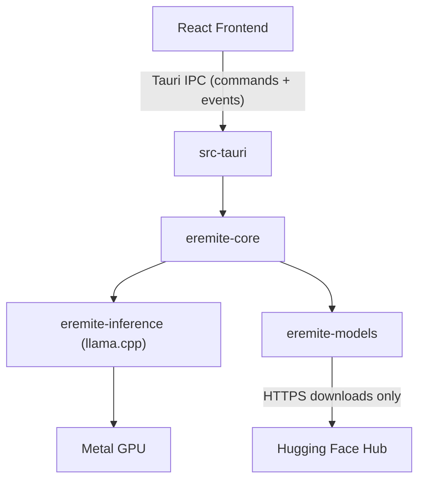

# Eremite Architecture

Eremite is a local LLM application that lets users download open source models and run them entirely on their own hardware. This document describes the system architecture.

## Overview



## Components

### eremite-core

Core engine library. Manages conversation state, configuration, and inference orchestration. All business logic lives here -- not in the frontend or the Tauri layer.

### eremite-inference

Wraps [llama.cpp](https://github.com/ggerganov/llama.cpp) via Rust bindings. Handles model loading, tokenization, and inference. Targets the GGUF model format with Metal GPU acceleration on macOS.

This crate has **no network dependencies**. It is fully offline by design.

### eremite-models

Downloads GGUF models from Hugging Face Hub, manages local model storage (`~/.eremite/models/`), and tracks model metadata.

This is the **only crate with network access** in the entire project.

### src-tauri

The Tauri v2 application shell. Wires `eremite-core`'s Rust API to Tauri commands and events for the frontend to consume.

### React Frontend

Presentation layer inside Tauri's system webview (WebKit on macOS). Lives in `src/` following Tauri conventions. Handles UI rendering and user interaction only.

## Data Flows

### Model Download

1. User browses or searches for models in the UI.
2. UI issues a Tauri command to `src-tauri`.
3. `eremite-models` fetches the GGUF file from Hugging Face Hub over HTTPS.
4. The model is stored locally in `~/.eremite/models/`.
5. Model metadata is registered in a local manifest.

### Inference

1. User sends a prompt via the UI.
2. UI issues a Tauri command to `src-tauri`.
3. `src-tauri` calls into `eremite-core`.
4. `eremite-core` delegates to `eremite-inference`, which runs llama.cpp.
5. Tokens are streamed back to the UI via Tauri events.
6. The UI renders tokens incrementally as they arrive.

**Zero network access is involved during inference.**

## Repository Structure

```
eremite/
  src/                         # React + TypeScript frontend (Tauri default location)
  src-tauri/                   # Tauri app entry point, commands, config
    src/
      main.rs
      lib.rs                   # Tauri command handlers
    Cargo.toml                 # Depends on eremite-core, eremite-inference, eremite-models
    tauri.conf.json
  crates/
    eremite-core/              # Core engine library (all business logic lives here)
    eremite-inference/         # llama.cpp bindings, inference logic (offline only)
    eremite-models/            # Model download and management (only crate with network)
  docs/                        # Architecture and design docs
  index.html                   # Vite entry point
  package.json                 # Frontend dependencies
  vite.config.ts
  tsconfig.json
  Cargo.toml                   # Workspace root: members = ["src-tauri", "crates/*"]
  LICENSE
  README.md
```

This follows standard Tauri conventions (`src/`, `src-tauri/`, root-level frontend config) with an added `crates/` directory for the Rust library code. Tauri CLI commands (`npx tauri dev`, `npx tauri build`) work without extra configuration.

The Cargo workspace keeps crates isolated. `eremite-inference` and `eremite-core` will never have networking crates in their dependency tree -- this is the structural privacy guarantee.

## Technology Stack

| Layer | Technology | Role |
|---|---|---|
| Inference | llama.cpp (via Rust bindings) | Model loading, tokenization, inference, Metal GPU |
| Core | Rust | Business logic, state management, orchestration |
| App shell | Tauri v2 | Native window, IPC, system integration |
| Frontend | React + TypeScript + Vite | UI rendering, user interaction |
| Models | GGUF format | Quantized model storage and loading |
| Model source | Hugging Face Hub | Public model downloads |

## Platform Support

The initial target is **macOS** with Metal GPU acceleration. The architecture supports future expansion to:

- Windows (Tauri + Vulkan/CUDA for inference)
- Linux (Tauri + Vulkan/CUDA for inference)
- iOS and Android (Tauri v2 mobile support)
